# BÁO CÁO PHÁT TRIỂN TOÀN DIỆN
## Dự Án Game Boss Fight 2D Platformer - C + Raylib
### Phiên bản MD2FILE: báo cáo kỹ thuật, flowchart, logic, lỗi và quá trình hoàn thiện

> Tài liệu này được viết lại theo phong cách MD2FILE để dễ preview, export PDF/HTML/Markdown và trình bày với team. Nội dung không dùng hình ảnh, chỉ dùng Markdown, bảng, checklist, code block và Mermaid flowchart.

---

## Quick Feature Overview

| Area | Nội dung trong báo cáo |
| --- | --- |
| Export formats | Phù hợp để export PDF, Markdown, HTML bằng MD2FILE |
| Images | Không dùng hình ảnh theo yêu cầu |
| Diagrams | Dùng Mermaid flowcharts cho game loop, boss AI, laser, atom bomb, asset pipeline, bug fixing |
| Code | Có fenced code blocks cho C, Python, Makefile, Bash |
| Structure | Có mục lục, bảng, checklist, blockquote, footnote |
| International text | Nội dung tiếng Việt; nếu export PDF nên bật CJK/Vietnamese font support nếu font lỗi |
| Mục tiêu | Tóm tắt toàn bộ cuộc hội thoại, quá trình hoàn thiện gameplay đánh boss, lỗi và logic kỹ thuật |

---

## Mục Lục

1. [Tóm Tắt Điều Team Đã Làm](#1-tóm-tắt-điều-team-đã-làm)
2. [Bối Cảnh Dự Án](#2-bối-cảnh-dự-án)
3. [Kiến Trúc Tổng Thể](#3-kiến-trúc-tổng-thể)
4. [Flowchart Tổng Quan](#4-flowchart-tổng-quan)
5. [Gameplay Loop](#5-gameplay-loop)
6. [Boss AI Và Phase System](#6-boss-ai-và-phase-system)
7. [Laser Attack V4](#7-laser-attack-v4)
8. [Atom Bomb Timer 5 Phút](#8-atom-bomb-timer-5-phút)
9. [Cheat Code NINELIVES](#9-cheat-code-ninelives)
10. [Orb, Explosion Và Fire Trail](#10-orb-explosion-và-fire-trail)
11. [Animation, Asset Và Tiled](#11-animation-asset-và-tiled)
12. [Âm Thanh Và UI HUD](#12-âm-thanh-và-ui-hud)
13. [Toàn Bộ Lỗi Đã Gặp](#13-toàn-bộ-lỗi-đã-gặp)
14. [Quá Trình Debug Và Hoàn Thiện](#14-quá-trình-debug-và-hoàn-thiện)
15. [Cấu Trúc Dữ Liệu](#15-cấu-trúc-dữ-liệu)
16. [Build, Rebuild Và Chạy Game](#16-build-rebuild-và-chạy-game)
17. [Chuẩn Hóa Bàn Giao Cho Team](#17-chuẩn-hóa-bàn-giao-cho-team)
18. [Checklist Hoàn Thành](#18-checklist-hoàn-thành)
19. [Kết Luận](#19-kết-luận)

---

## 1. Tóm Tắt Điều Team Đã Làm

Dự án hiện tại là một game **2D Platformer Boss Fight** viết bằng **C + Raylib 5.0**, trong đó người chơi điều khiển nhân vật mèo chiến đấu với Boss **AGIS**. Vai trò chính trong cuộc hội thoại này là **tạo gameplay đánh boss**, bao gồm thiết kế vòng lặp chiến đấu, boss AI, skill, phase, hiệu ứng, timer ép thời gian, debug và build.

### Những phần đã được triển khai hoặc hoàn thiện

- [x] Boss fight core loop: player điều khiển mèo, né đòn, tấn công boss bằng orb.
- [x] Boss có nhiều phase theo phần trăm máu.
- [x] Boss có hệ thống chọn chiêu chống spam.
- [x] Laser được làm lại nhiều lần đến phiên bản V4.
- [x] Cheat code `NINELIVES` để bật/tắt God Mode.
- [x] Timer 5 phút ép trận đấu kết thúc bằng Atom Bomb.
- [x] Trash talk cho boss theo ngữ cảnh.
- [x] Tích hợp asset âm thanh, sprite mèo, boss, explosion, fire trail, laser texture.
- [x] Viết script Python để convert/pack asset.
- [x] Debug lỗi atom bomb nổ ngay khi vào game.
- [x] Full rebuild để đồng bộ struct layout.
- [x] Test chạy được `bossfight_final.exe` và load asset thành công.

> Tóm lại: cuộc hội thoại xoay quanh việc biến dự án từ các mảnh ghép rời rạc như Tiled, sprite, animation, âm thanh, Raylib code thành một gameplay boss fight có logic, có nhịp combat, có phase, có hiệu ứng và có quy trình build/test.

---

## 2. Bối Cảnh Dự Án

### 2.1. Công nghệ sử dụng

| Thành phần | Công nghệ |
| --- | --- |
| Game engine/library | Raylib 5.0 |
| Ngôn ngữ | C |
| Build | Makefile / GCC |
| Map tool | Tiled `.tmx`, `.tmj`, `.tsx` |
| Asset processing | Python + Pillow |
| Platform test | Windows Desktop |
| Graphics backend | GLFW + OpenGL 3.3 |
| Audio backend | miniaudio / WASAPI |

### 2.2. Vai trò trong team

Vai trò được xác định trong cuộc hội thoại là **người tạo gameplay đánh boss**, nghĩa là không chỉ vẽ map hay làm animation riêng lẻ, mà phải ráp toàn bộ thành một vòng chơi hoàn chỉnh:

1. Player có input, movement, animation, HP.
2. Boss có HP, phase, AI, attack pattern.
3. Attack có cảnh báo, hitbox, cooldown, counterplay.
4. Asset được load đúng và vẽ đúng frame.
5. Game có điều kiện thắng/thua.
6. Có debug tool để test nhanh.
7. Có build/rebuild ổn định.

### 2.3. Mục tiêu gameplay

| Mục tiêu | Mô tả |
| --- | --- |
| Công bằng | Attack phải có cảnh báo, người chơi có thể né được |
| Căng thẳng | Boss càng ít máu càng nguy hiểm |
| Không spam | Boss không được lặp một chiêu quá nhiều |
| Có giới hạn thời gian | Sau 5 phút nếu chưa thắng thì Atom Bomb nổ |
| Dễ test | Có cheat `NINELIVES` để test phase/attack |
| Dễ bàn giao | Asset, code, build command, logic được ghi lại rõ |

---

## 3. Kiến Trúc Tổng Thể

### 3.1. File structure chính

```txt
boss/
├── Makefile
├── README.md
├── convert_tif.py
├── DEVELOPMENT_REPORT.md
├── bossfight_final.exe
├── assets/
│   ├── start.ogg
│   ├── backgroundsound/
│   │   ├── phrase1and2.ogg
│   │   ├── phrase3.ogg
│   │   ├── phrase4.ogg
│   │   └── ending.ogg
│   ├── laugh.ogg
│   ├── damage.ogg
│   ├── alarm.ogg
│   ├── hits.ogg
│   ├── slash.ogg
│   ├── sprites/
│   │   ├── agis.png
│   │   └── cat/
│   │       ├── IDLE.png
│   │       ├── WALK.png
│   │       ├── RUN.png
│   │       ├── JUMP.png
│   │       └── HURT.png
│   ├── explosion/
│   │   └── Explosion.png
│   ├── laser/
│   │   ├── texture_laser.png
│   │   └── texture_laser.tsx
│   └── shipfire/
│       └── orb_fire_sheet.png
└── src/
    ├── main.c
    ├── boss.c
    ├── boss.h
    ├── player.c
    ├── player.h
    ├── orb.c
    ├── orb.h
    ├── cheat.h
    ├── game.c
    ├── game.h
    ├── map.c
    ├── map.h
    ├── camera.c
    ├── camera.h
    ├── cute_tiled.h
    ├── parson.c
    └── parson.h
```

### 3.2. Trách nhiệm từng module

| File | Vai trò |
| --- | --- |
| `main.c` | Entry point, init Raylib, game loop, gọi update/draw |
| `boss.c` / `boss.h` | Boss AI, phase, attack, laser, atom bomb, taunt |
| `player.c` / `player.h` | Player movement, input, animation, HP, damage |
| `orb.c` / `orb.h` | Projectile của player, fire trail, explosion khi hit |
| `cheat.h` | Cheat code `NINELIVES`, God Mode |
| `camera.c` / `camera.h` | Camera follow và shake |
| `map.c` / `map.h` | Map/Tiled integration |
| `convert_tif.py` | Convert `.tif` sang `.png`, pack spritesheet |
| `Makefile` | Build executable |

---

## 4. Flowchart Tổng Quan

### 4.1. Tổng quan toàn bộ project

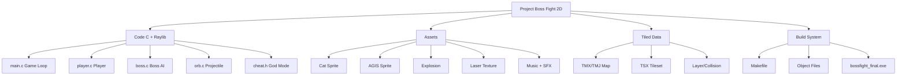

### 4.2. Pipeline từ asset đến gameplay

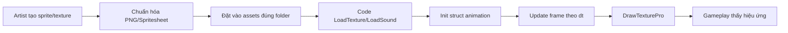

### 4.3. Pipeline map Tiled đến game

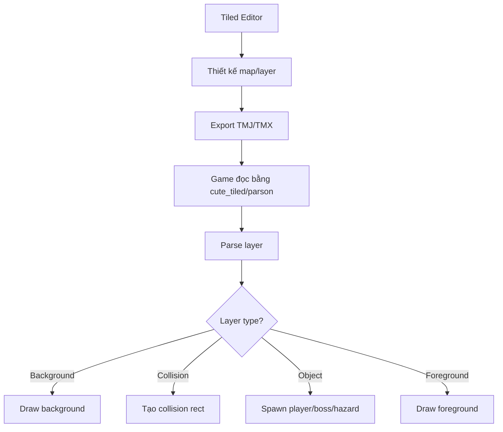

---

## 5. Gameplay Loop

### 5.1. Game loop chuẩn Raylib

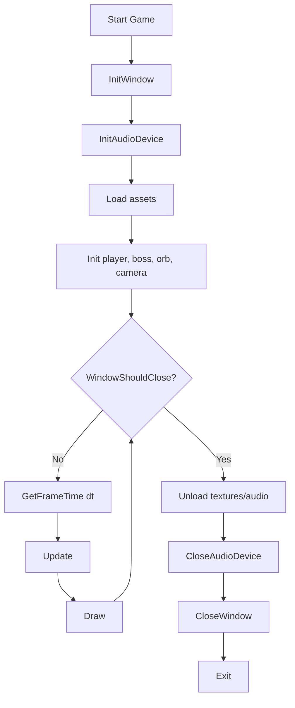

### 5.2. Update loop chi tiết

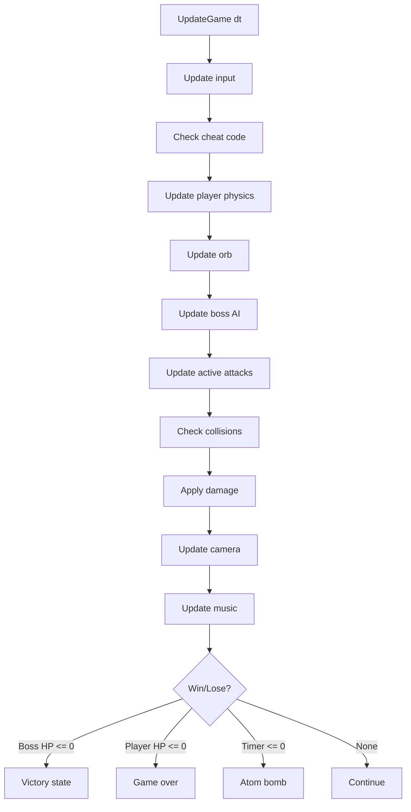

### 5.3. Draw loop chi tiết

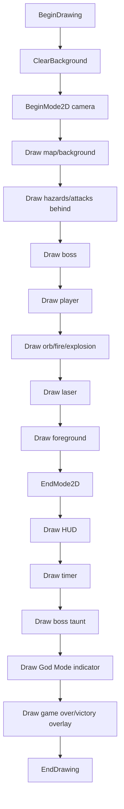

---

## 6. Boss AI Và Phase System

### 6.1. Mục tiêu Boss AI

Boss AI cần đạt 4 điều:

- Có nhịp tấn công rõ ràng, không random vô nghĩa.
- Càng về cuối càng căng nhưng không bất công.
- Mỗi chiêu có counterplay: né, nhảy, chạy ra mép, quan sát cảnh báo.
- Không spam cùng một chiêu liên tục.

### 6.2. Phase table

| Phase | Điều kiện HP | Mức độ | Chiêu mở khóa | Ghi chú balance |
| --- | --- | --- | --- | --- |
| Phase 1 | 100% - 75% | Dễ | Basic orb, laser, slam | Cho người chơi làm quen |
| Phase 2 | 75% - 50% | Trung bình | Thêm hazard | Bắt đầu kiểm soát không gian |
| Phase 3 | 50% - 25% | Khó | Thêm rain | Ép di chuyển nhiều hơn |
| Phase 4 | 25% - 0% | Enrage | Tần suất cao hơn | Đã giảm spam từ 0.8s sang 1.5s |

### 6.3. Flowchart phase transition

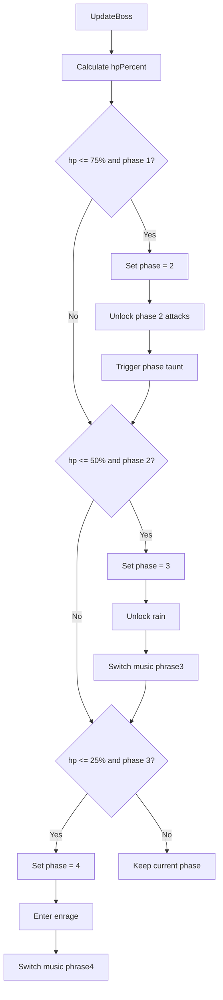

### 6.4. Flowchart chọn đòn chống spam

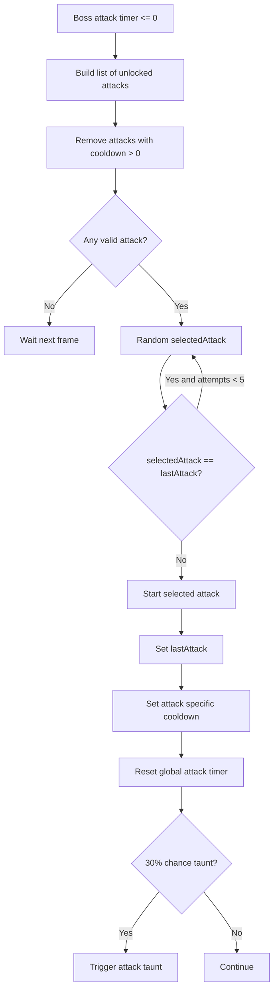

### 6.5. Attack cooldown table

| Attack | Cooldown | Lý do |
| --- | ---: | --- |
| Orb/projectile | 3.0s | Đòn cơ bản, dùng thường xuyên |
| Laser | 4.0s | Nguy hiểm, cần hạn chế spam |
| Slam | 3.5s | Có warning, nhưng gây áp lực gần |
| Hazard | 5.0s | Kiểm soát sàn, nếu spam sẽ bí đường |
| Rain | 5.0s | Ép né theo vùng, cần khoảng nghỉ |
| Special 1 | 6.0s | Dành cho phase cao |
| Special 2 | 8.0s | Đòn nặng, không dùng liên tục |

---

## 7. Laser Attack V4

Laser là phần được chỉnh nhiều nhất trong cuộc hội thoại, vì nó ảnh hưởng trực tiếp đến cảm giác công bằng của boss fight.

### 7.1. Các phiên bản laser

| Version | Cách hoạt động | Vấn đề | Kết quả |
| --- | --- | --- | --- |
| V1 | Laser tracking thẳng từ boss tới player | Quá bất công, khó né | Bỏ |
| V2 | Có warning 2s và lock vị trí | Nếu player nhảy thì lock trên không | Cần sửa |
| V3 | Project vị trí lock xuống sàn `y = 620` | Laser vẫn teleport ra ngay | Cần sửa |
| V4 | Warning -> lock -> project -> extend -> cut ở mép map | Công bằng hơn | Dùng hiện tại |

### 7.2. Laser state machine

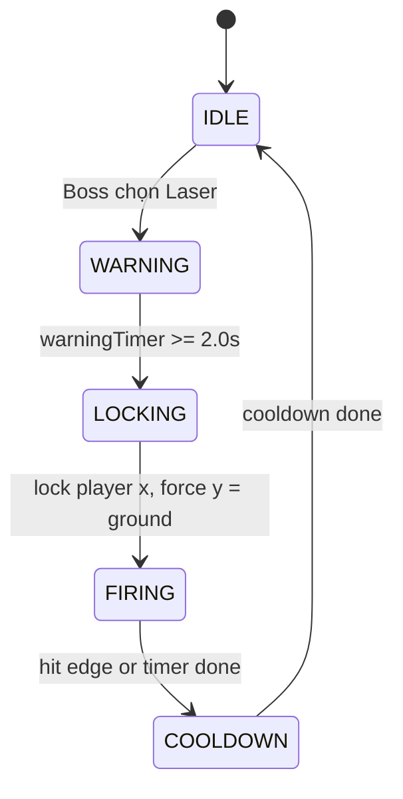

### 7.3. Laser flowchart chi tiết

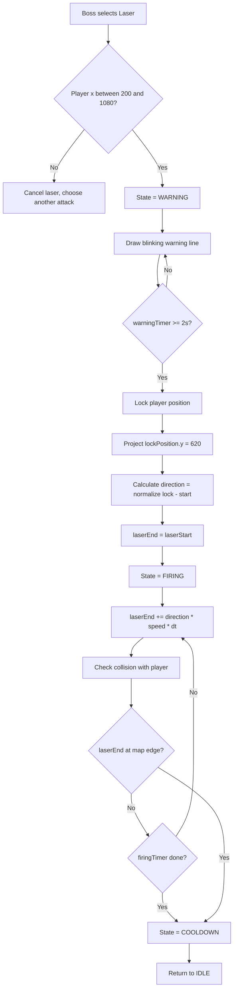

### 7.4. Mermaid sequence của laser

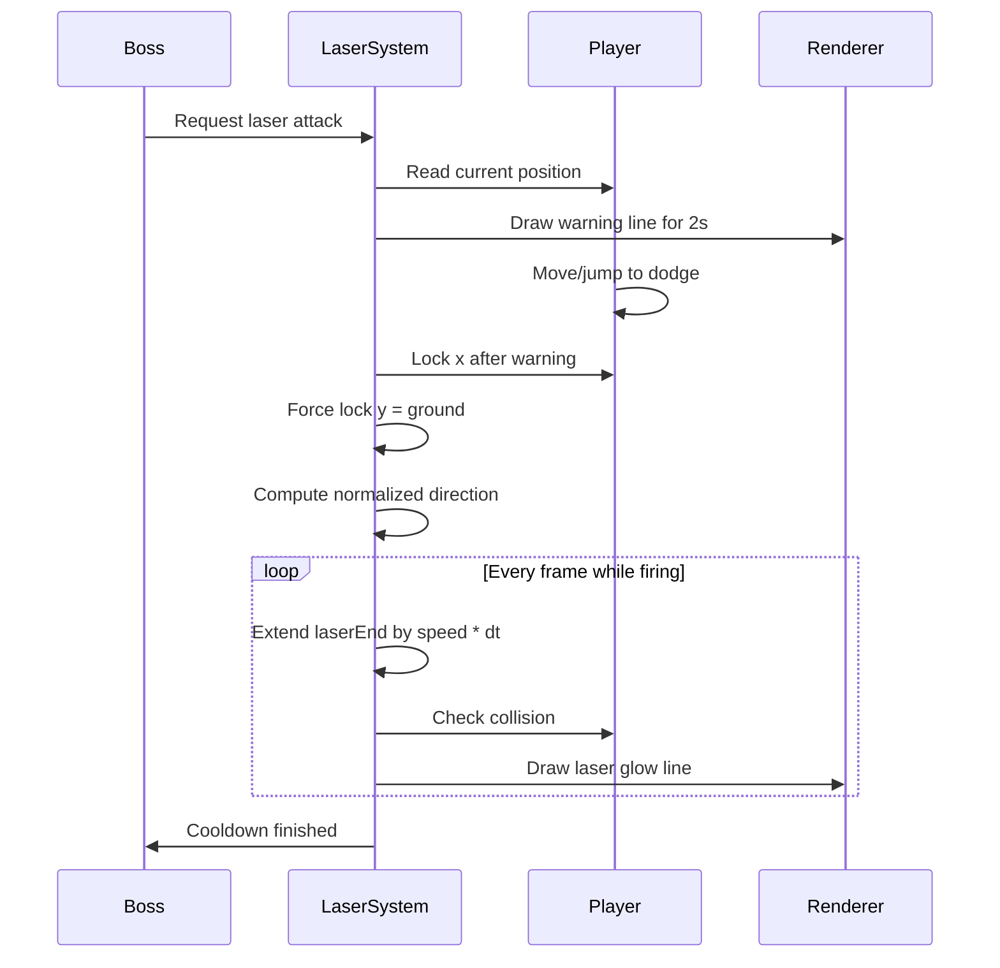

### 7.5. Công thức laser

```c
Vector2 delta = {
    lockPosition.x - laserStart.x,
    lockPosition.y - laserStart.y
};

float length = sqrtf(delta.x * delta.x + delta.y * delta.y);
laserDirection.x = delta.x / length;
laserDirection.y = delta.y / length;

laserEnd.x += laserDirection.x * LASER_EXTEND_SPEED * dt;
laserEnd.y += laserDirection.y * LASER_EXTEND_SPEED * dt;
```

### 7.6. Lý do chưa dùng `texture_laser.png`

Texture laser đã load thành công:

| Asset | Thông số |
| --- | --- |
| File | `assets/laser/texture_laser.png` |
| Kích thước | 2048 x 2048 |
| TSX grid | 4 cột x 3 hàng |
| Frame | 512 x 655 |
| Animation | Skip frame 4, mỗi frame 100ms |

Hiện laser vẫn dùng `DrawLineEx` vì:

- Laser trong game có thể xoay theo nhiều góc.
- Dùng sprite cần `DrawTexturePro` + rotation + scale + source rect.
- Với mục tiêu gameplay hiện tại, `DrawLineEx` dễ kiểm soát hitbox và warning hơn.

---

## 8. Atom Bomb Timer 5 Phút

### 8.1. Mục tiêu thiết kế

Atom Bomb được thêm để tránh việc người chơi câu giờ quá lâu. Sau 5 phút nếu boss chưa chết, game ép thua bằng một sự kiện lớn: flash màn hình, camera shake, mushroom cloud và Game Over.

### 8.2. Timeline Atom Bomb

```mermaid
flowchart LR
  A[00:00 Start fight] --> B[00:00 - 04:30 Normal fight]
  B --> C[04:30 Warning phase]
  C --> D[Boss taunt: MAY GA VCL]
  D --> E[Alarm / timer red]
  E --> F[05:00 Atom triggered]
  F --> G[White flash]
  G --> H[Mushroom cloud]
  H --> I[Camera shake]
  I --> J[Player forced death]
  J --> K[Game Over]
```

### 8.3. Atom Bomb state flow

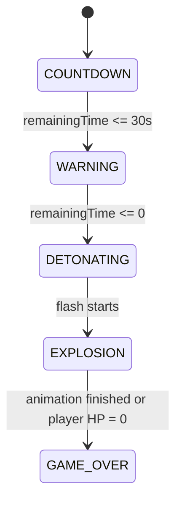

### 8.4. Logic countdown

```c
boss->fightTimer -= dt;

if (boss->fightTimer <= 30.0f && !boss->warningPlayed) {
    TriggerTrashTalk(boss, "MAY GA VCL!");
    PlaySound(alarmSound);
    boss->warningPlayed = 1;
}

if (boss->fightTimer <= 0.0f && !boss->atomTriggered) {
    boss->atomTriggered = 1;
    gAtomBombActive = 1;
}
```

### 8.5. UI timer

```c
int minutes = (int)(boss->fightTimer / 60.0f);
int seconds = (int)boss->fightTimer % 60;
Color timerColor = boss->fightTimer <= 30.0f ? RED : WHITE;
DrawText(TextFormat("%02d:%02d", minutes, seconds), 590, 20, 40, timerColor);
```

---

## 9. Cheat Code NINELIVES

### 9.1. Mục đích

Cheat code được tạo để debug game nhanh hơn, nhất là khi cần test phase 3/4, laser, atom bomb, explosion mà không muốn chết liên tục.

### 9.2. Flowchart cheat code

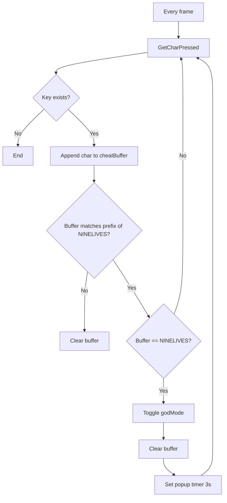

### 9.3. Damage flow với God Mode

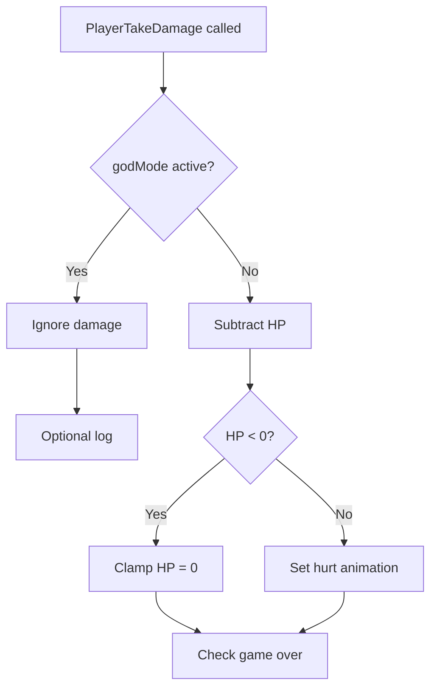

### 9.4. Lý do dùng `NINELIVES`

- Liên quan đến mèo: mèo có 9 mạng.
- Dễ nhớ với team.
- Khó bấm nhầm trong gameplay.
- Phù hợp vai trò debug/dev mode.

---

## 10. Orb, Explosion Và Fire Trail

### 10.1. Vai trò Orb

Orb là đòn đánh chính của player để gây sát thương lên boss. Nó không chỉ là hitbox mà còn có trạng thái bay, rơi, trail lửa và explosion khi va chạm.

### 10.2. Orb state machine

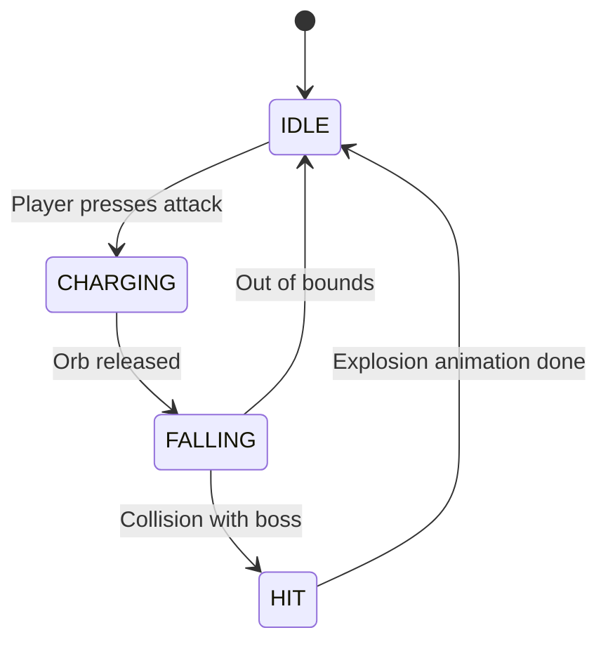

### 10.3. Orb update flow

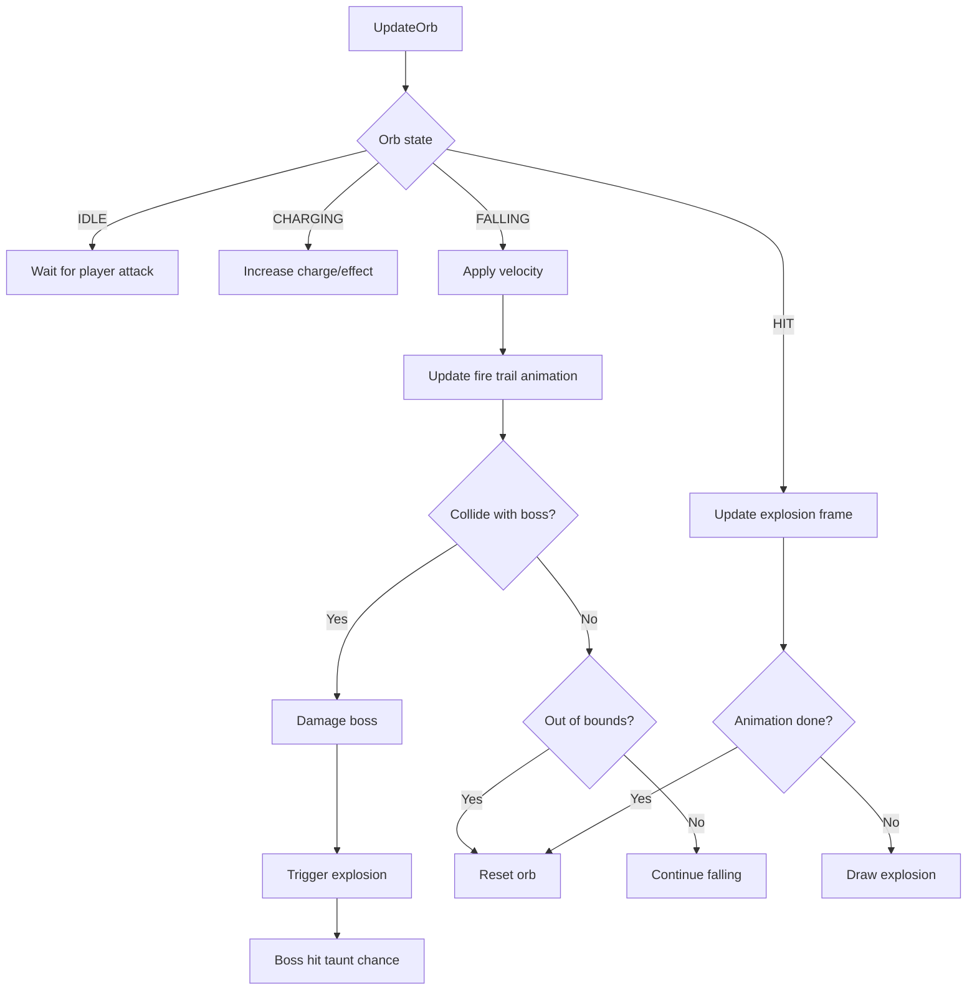

### 10.4. Explosion frame logic

```c
explosionFrameTimer += dt;
if (explosionFrameTimer >= 0.05f) {
    explosionFrameTimer = 0.0f;
    explosionFrame++;
    if (explosionFrame >= 12) {
        explosionActive = 0;
    }
}
```

---

## 11. Animation, Asset Và Tiled

### 11.1. Cat animation table

| Animation | File | Texture size | Frame count | Frame size | Ghi chú |
| --- | --- | ---: | ---: | ---: | --- |
| IDLE | `cat/IDLE.png` | 640x64 | 10 | 64x64 | Đứng yên |
| WALK | `cat/WALK.png` | 960x64 | 15 | 64x64 | Đi bộ |
| RUN | `cat/RUN.png` | 640x64 | 10 | 64x64 | Chạy |
| JUMP | `cat/JUMP.png` | 240x64 | 4 | 60x64 | Nhảy |
| HURT | `cat/HURT.png` | 320x64 | 5 | 64x64 | Bị thương |

### 11.2. Animation switching flow

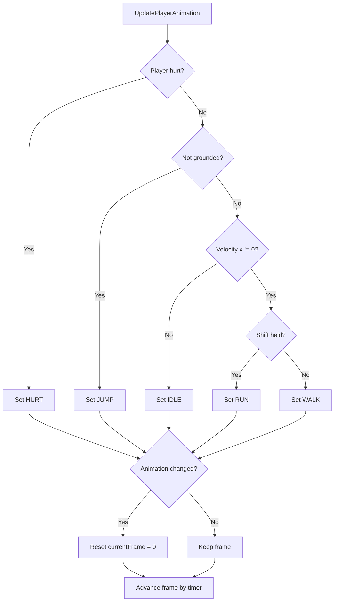

### 11.3. Asset conversion flow

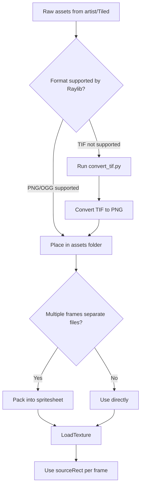

### 11.4. Tiled layer chuẩn đề xuất

| Layer | Type | Người phụ trách | Dữ liệu bàn giao |
| --- | --- | --- | --- |
| `Background` | Tile layer | Level Designer | Không collision |
| `Ground` | Tile layer | Level Designer | Nền đi được |
| `Collision` | Object layer | Dev gameplay | Rect va chạm |
| `SpawnPoints` | Object layer | Level Designer/Dev | PlayerSpawn, BossSpawn |
| `HazardZones` | Object layer | Gameplay Dev | Vùng nguy hiểm |
| `Foreground` | Tile layer | Artist/Level Designer | Vẽ trên player |

---

## 12. Âm Thanh Và UI HUD

### 12.1. Audio load result đã kiểm tra

Khi chạy game, Raylib log cho thấy các file âm thanh được load thành công:

| File | Loại | Trạng thái |
| --- | --- | --- |
| `assets/start.ogg` | Music | Loaded successfully |
| `assets/backgroundsound/phrase1and2.ogg` | Music | Loaded successfully |
| `assets/backgroundsound/phrase3.ogg` | Music | Loaded successfully |
| `assets/backgroundsound/phrase4.ogg` | Music | Loaded successfully |
| `assets/backgroundsound/ending.ogg` | Music | Loaded successfully |
| `assets/laugh.ogg` | Sound | Loaded successfully |
| `assets/damage.ogg` | Sound | Loaded successfully |
| `assets/alarm.ogg` | Sound | Loaded successfully |
| `assets/hits.ogg` | Sound | Loaded successfully |
| `assets/slash.ogg` | Sound | Loaded successfully |

### 12.2. Music phase flow

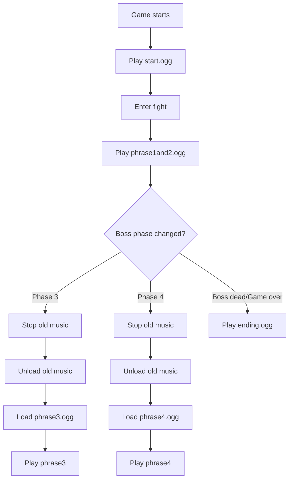

### 12.3. HUD elements

| HUD | Vị trí | Mục đích |
| --- | --- | --- |
| Boss HP | Trên cùng | Cho biết tiến độ đánh boss |
| Player HP | Góc dưới/trái | Cho biết khả năng sống sót |
| Timer | Trên giữa | Áp lực 5 phút |
| Phase text | Giữa màn hình | Báo boss chuyển phase |
| Taunt | Trên đầu boss | Tạo tính cách và feedback |
| God Mode | Góc phải | Debug status |
| Game Over/Victory | Center overlay | Kết thúc vòng chơi |

---

## 13. Toàn Bộ Lỗi Đã Gặp

### 13.1. Bảng tổng hợp lỗi

| ID | Lỗi | Mức độ | Nguyên nhân | Cách xử lý |
| --- | --- | --- | --- | --- |
| Bug 01 | `main.c` bị revert | Rất nặng | File bị process ngoài ghi đè | Tách logic sang `cheat.h` và `player.c` |
| Bug 02 | Atom bomb nổ ngay | Rất nặng | `.o` cũ lệch struct layout | Full rebuild toàn bộ object files |
| Bug 03 | Laser lock trên không | Nặng | Lock đúng vị trí player khi player nhảy | Force `lockPosition.y = 620` |
| Bug 04 | Laser teleport | Trung bình | Set laserEnd trực tiếp đến target | Extend theo vector mỗi frame |
| Bug 05 | TIF không load | Trung bình | Raylib không hỗ trợ TIFF | Convert sang PNG bằng Pillow |
| Bug 06 | Boss spam chiêu | Nặng | Random attack thuần túy | No-repeat + cooldown |
| Bug 07 | Phase 4 quá khó | Trung bình | Attack interval quá thấp | Tăng 0.8s lên 1.5s |
| Bug 08 | Slam khó né | Trung bình | Warning quá ngắn | Tăng warning 1.2s lên 2.0s |
| Bug 09 | Asset load path dễ sai | Nhẹ/Nặng tùy case | Chạy exe sai working directory | Chạy từ thư mục `boss` đúng asset path |
| Bug 10 | Laser texture chưa dùng | Không phải bug runtime | Cần rotation phức tạp | Tạm dùng `DrawLineEx` |

### 13.2. Flowchart debug lỗi atom bomb

```mermaid
flowchart TD
  A[Game starts] --> B[Timer shows around 04:52]
  B --> C[Atom bomb triggers immediately]
  C --> D{Timer actually <= 0?}
  D -->|No| E[Check atomTriggered value]
  E --> F[atomTriggered is garbage/true]
  F --> G{Struct Boss changed?}
  G -->|Yes| H[main.o may be old]
  H --> I[Delete all .o files]
  I --> J[Recompile every .c]
  J --> K[Relink exe]
  K --> L[Run again]
  L --> M[Timer starts at 05:00 correctly]
```

### 13.3. Flowchart debug `main.c` bị revert

```mermaid
flowchart TD
  A[Need add cheat logic] --> B[Edit main.c]
  B --> C[File saved]
  C --> D[File reverts unexpectedly]
  D --> E{Retry direct edit?}
  E -->|Yes| F[Still reverts]
  E -->|No| G[Find alternative architecture]
  F --> G
  G --> H[Create cheat.h]
  H --> I[Move cheat buffer/state there]
  I --> J[Call/check from player.c]
  J --> K[Draw God Mode UI in player draw]
  K --> L[Feature works without touching main.c]
```

### 13.4. Flowchart debug laser

```mermaid
flowchart TD
  A[Laser feels unfair/wrong] --> B{Problem type?}
  B -->|Tracks player forever| C[Add warning + lock]
  B -->|Locks mid-air| D[Project target to ground]
  B -->|Teleports| E[Use extend over time]
  B -->|Corner trap| F[Restrict spawn x range + cut at edges]
  C --> G[Test gameplay]
  D --> G
  E --> G
  F --> G
  G --> H{Player has counterplay?}
  H -->|No| A
  H -->|Yes| I[Accept V4]
```

---

## 14. Quá Trình Debug Và Hoàn Thiện

### 14.1. Timeline phát triển theo cuộc hội thoại

```mermaid
flowchart TD
  A[Ban đầu: hỏi quy trình phối hợp Tiled + animation + gameplay boss] --> B[Xác định role: tạo gameplay đánh boss]
  B --> C[Phân tích code/project Raylib]
  C --> D[Thiết kế boss fight systems]
  D --> E[Thêm cheat NINELIVES]
  E --> F[Gặp lỗi main.c revert]
  F --> G[Modular hóa cheat]
  G --> H[Thiết kế anti-spam boss AI]
  H --> I[Làm lại laser nhiều phiên bản]
  I --> J[Thêm trash talk]
  J --> K[Thêm atom bomb timer]
  K --> L[Gặp bug atom bomb nổ ngay]
  L --> M[Full rebuild]
  M --> N[Test exe chạy OK]
  N --> O[Viết báo cáo]
  O --> P[Viết lại báo cáo theo MD2FILE + flowcharts]
```

### 14.2. Kiểm chứng chạy game

Khi chạy `bossfight_final.exe`, log Raylib cho thấy:

- Raylib 5.0 init thành công.
- OpenGL 3.3 init thành công.
- Audio device init thành công.
- Các file music `.ogg` load thành công.
- Các file sound `.ogg` load thành công.
- Sprite mèo, boss, explosion, laser texture, orb fire sheet load thành công.
- Khi đóng cửa sổ, texture/audio được unload bình thường.

### 14.3. Ý nghĩa của việc full rebuild

Trong C, thay đổi header hoặc struct không đảm bảo mọi object file được build lại nếu build system không track dependency đúng. Vì vậy khi thêm field vào `Boss`, bắt buộc clean object cũ.

```mermaid
flowchart LR
  A[Change boss.h struct] --> B[Old main.o still uses old size]
  B --> C[Runtime reads wrong offsets]
  C --> D[Garbage atomTriggered]
  D --> E[Atom bomb triggers]
  E --> F[Clean .o]
  F --> G[Compile all .c]
  G --> H[Struct layout synced]
```

---

## 15. Cấu Trúc Dữ Liệu

### 15.1. Boss struct khái niệm

```c
typedef struct Boss {
    int hp;
    int maxHp;
    int phase;

    Rectangle rect;
    Vector2 position;

    int lastAttack;
    float attackCooldown;
    float attackInterval;
    float attackCooldowns[7];

    LaserAttack laser;

    float fightTimer;
    int atomTriggered;
    float atomBombAnimTimer;

    char currentTaunt[64];
    float tauntTimer;
    int tauntActive;

    int currentFrame;
    float frameTimer;
} Boss;
```

### 15.2. LaserAttack struct khái niệm

```c
typedef enum LaserState {
    LASER_IDLE,
    LASER_WARNING,
    LASER_LOCKING,
    LASER_FIRING,
    LASER_COOLDOWN
} LaserState;

typedef struct LaserAttack {
    LaserState state;
    Vector2 lockPosition;
    Vector2 laserStart;
    Vector2 laserEnd;
    Vector2 laserDirection;
    float stateTimer;
    float warningDuration;
    float firingDuration;
    float cooldownDuration;
} LaserAttack;
```

### 15.3. Player struct khái niệm

```c
typedef struct BossPlayer {
    Rectangle rect;
    Vector2 position;
    Vector2 velocity;
    int health;
    int maxHealth;
    int isGrounded;
    int facingRight;
    float invincibleTimer;

    int currentAnim;
    int currentFrame;
    float frameTimer;
} BossPlayer;
```

### 15.4. Orb struct khái niệm

```c
typedef enum OrbState {
    ORB_IDLE,
    ORB_CHARGING,
    ORB_FALLING,
    ORB_HIT
} OrbState;

typedef struct Orb {
    OrbState state;
    Vector2 position;
    Vector2 velocity;
    Rectangle rect;
    int damage;
    int currentFrame;
    float frameTimer;
} Orb;
```

---

## 16. Build, Rebuild Và Chạy Game

### 16.1. Build thường

```bash
cd boss
make
```

### 16.2. Rebuild khi đổi struct/header

```bash
cd boss
make clean
make
```

Hoặc trên Windows CMD:

```bat
cd boss
del /Q src\*.o bossfight_final.exe 2>nul
make
```

### 16.3. Chạy game đúng thư mục

```bash
cd boss
bossfight_final.exe
```

> Quan trọng: chạy exe từ đúng thư mục `boss` để relative path như `assets/start.ogg` hoạt động.

### 16.4. Manual rebuild flowchart

```mermaid
flowchart TD
  A[Need rebuild] --> B[Close running game]
  B --> C[Delete old .o files]
  C --> D[Compile main.c]
  D --> E[Compile boss.c]
  E --> F[Compile player.c]
  F --> G[Compile orb.c]
  G --> H[Compile other modules]
  H --> I[Link bossfight_final.exe]
  I --> J[Run exe]
  J --> K{Assets loaded?}
  K -->|Yes| L[Test gameplay]
  K -->|No| M[Check working directory/path]
```

---

## 17. Chuẩn Hóa Bàn Giao Cho Team

### 17.1. Quy tắc bàn giao asset

| Loại asset | Format | Quy ước |
| --- | --- | --- |
| Sprite sheet | PNG | Transparent background, frame đều nhau |
| Music | OGG | Loopable nếu là background music |
| Sound effect | OGG/WAV | Ngắn, volume normalize |
| Tiled map | TMJ/TMX | Layer đặt tên rõ |
| Tileset | TSX/PNG | Path tương đối đúng |

### 17.2. Quy tắc bàn giao code

- Header `.h` chỉ khai báo struct, enum, prototype.
- Source `.c` chứa logic triển khai.
- Không sửa `main.c` nếu không cần; ưu tiên module hóa.
- Nếu đổi struct trong header, báo team rebuild toàn bộ.
- Mỗi attack nên có state riêng, timer riêng, cooldown riêng.

### 17.3. Quy tắc bàn giao Tiled map

```mermaid
flowchart TD
  A[Level Designer chỉnh map] --> B[Đặt layer đúng tên]
  B --> C[Export TMJ/TMX]
  C --> D[Commit map + tileset + texture]
  D --> E[Gameplay Dev pull]
  E --> F[Test load map]
  F --> G{Collision đúng?}
  G -->|No| H[Sửa object layer]
  H --> C
  G -->|Yes| I[Map accepted]
```

### 17.4. Checklist trước khi gửi cho team

- [ ] Game build được từ clean state.
- [ ] `bossfight_final.exe` chạy từ thư mục `boss`.
- [ ] Không thiếu asset path.
- [ ] Timer bắt đầu đúng `05:00`.
- [ ] Atom bomb không nổ ngay.
- [ ] Laser có warning trước khi bắn.
- [ ] Boss không spam cùng một chiêu liên tục.
- [ ] Cheat `NINELIVES` bật/tắt được.
- [ ] Music phase chuyển đúng.
- [ ] Report `DEVELOPMENT_REPORT.md` export PDF được bằng MD2FILE.

---

## 18. Checklist Hoàn Thành

- [x] Tóm tắt toàn bộ bối cảnh dự án.
- [x] Ghi lại vai trò gameplay boss fight.
- [x] Mô tả kiến trúc file/module.
- [x] Thêm nhiều flowchart Mermaid tiêu chuẩn.
- [x] Mô tả game loop/update/draw loop.
- [x] Mô tả boss AI/phase/cooldown/no-repeat.
- [x] Mô tả Laser V1 đến V4.
- [x] Mô tả Atom Bomb 5 phút.
- [x] Mô tả cheat code `NINELIVES`.
- [x] Mô tả Orb, Explosion, Fire Trail.
- [x] Mô tả asset pipeline và Tiled workflow.
- [x] Liệt kê lỗi, nguyên nhân, cách xử lý.
- [x] Ghi rõ build/rebuild/run command.
- [x] Chuẩn hóa bàn giao cho team.

---

## 19. Kết Luận

Dự án đã đi từ giai đoạn rời rạc giữa **Tiled map**, **sprite animation**, **Raylib code**, **boss gameplay** sang một bản boss fight có cấu trúc rõ hơn. Phần quan trọng nhất không chỉ là thêm hiệu ứng, mà là tạo được một hệ thống có thể test, debug, balance và bàn giao.

Các bài học lớn nhất:

1. **Gameplay boss cần state machine**, không nên chỉ random attack đơn giản.
2. **Laser/hitbox phải có warning và counterplay** để người chơi thấy công bằng.
3. **C project phải full rebuild khi đổi struct/header**, nếu không rất dễ gặp memory garbage.
4. **Asset pipeline cần chuẩn hóa format**, đặc biệt khi dùng Raylib.
5. **Báo cáo kỹ thuật nên có flowchart**, vì giúp team hiểu nhanh luồng Update/Draw/AI/Debug.

> Phiên bản báo cáo này đã được chuyển sang format phù hợp MD2FILE, không dùng hình ảnh, có nhiều Mermaid flowchart để export PDF/HTML/Markdown.

---

## Footnotes

[^1]: Nếu export PDF bị lỗi font tiếng Việt, hãy bật tùy chọn CJK/International font support trong MD2FILE hoặc chọn template có font Unicode tốt.
